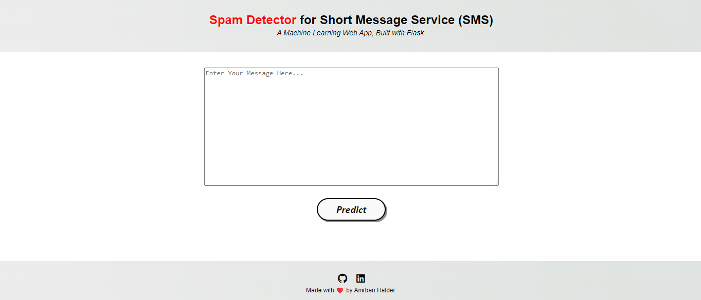

<p align="center">
    <a href="https://github.com/Anirbanrohan/Technology-Lookup-Web-Application">
      <h3 align="center">Spam Classification</h3>
    </a>
  </p>
  <p align="center"><i>You'll get to know whether a message is spam or not.</i></p>
  <div align="center">
    <a href="https://github.com/Anirbanrohan/Technology-Lookup-Web-Application/stargazers"></a>
  <a href="https://github.com/Anirbanrohan/Technology-Lookup-Web-Application/network/members"></a>
  <a href="https://github.com/Anirbanrohan/Technology-Lookup-Web-Application/issues"></a>
  </div>
  <br>
  
  This repo aims to find whether a message is spam or not.
  
  
  <details open="open">
    <summary><h2 style="display: inline-block">Contents</h2></summary>
    <ol>
      <li>
        <a href="#about-the-project">About The Project</a>
        <ul>
          <li><a href="#built-with">Built With</a></li>
        </ul>
      </li>
      <li>
        <a href="#getting-started">Getting Started</a>
        <ul>
          <li><a href="#installation">Installation</a></li>
        </ul>
      </li>
      <li><a href="#contact">Contact</a></li>
    </ol>
  </details>
  
  
  ## About The Project
  
  This is a Machine Learning Project on spam classification.It consists of two pages home and result.In the home page you can type any message.It will predict whether it is a spam message or not.Then the result page will showing the result.
  
  ### Screenshot 1
  
  
  
  ### Video 1
  
  
  
  ### Video 2
  
  
  
  
  ### Built With
  
  * Python
  * HTML
  * Requests
  * Flask
  * CSS
    
  
  
  
  ## Getting Started
  
  To get a local copy up and running follow these simple steps.
  
  
  
  ### Installation
  
  1. Clone the repo
  
     ```sh
     git clone https://github.com/Anirbanrohan/Spam_Classification.git
     ```
     
  
  
  ## Contact
  
  Anirban Halder
  
  LinkedIn: https://www.linkedin.com/in/anirban-halder-b252a7258/
  
  
  
  
  
  ## :man_astronaut: Show your support
  
  Give a ⭐️ if you liked this project!
  
